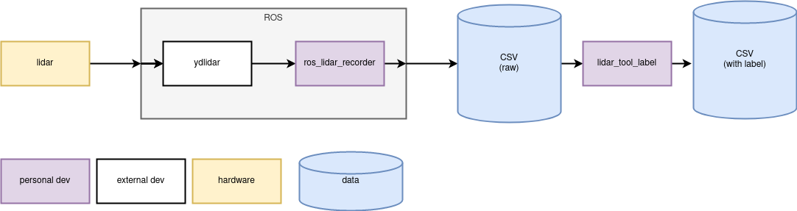
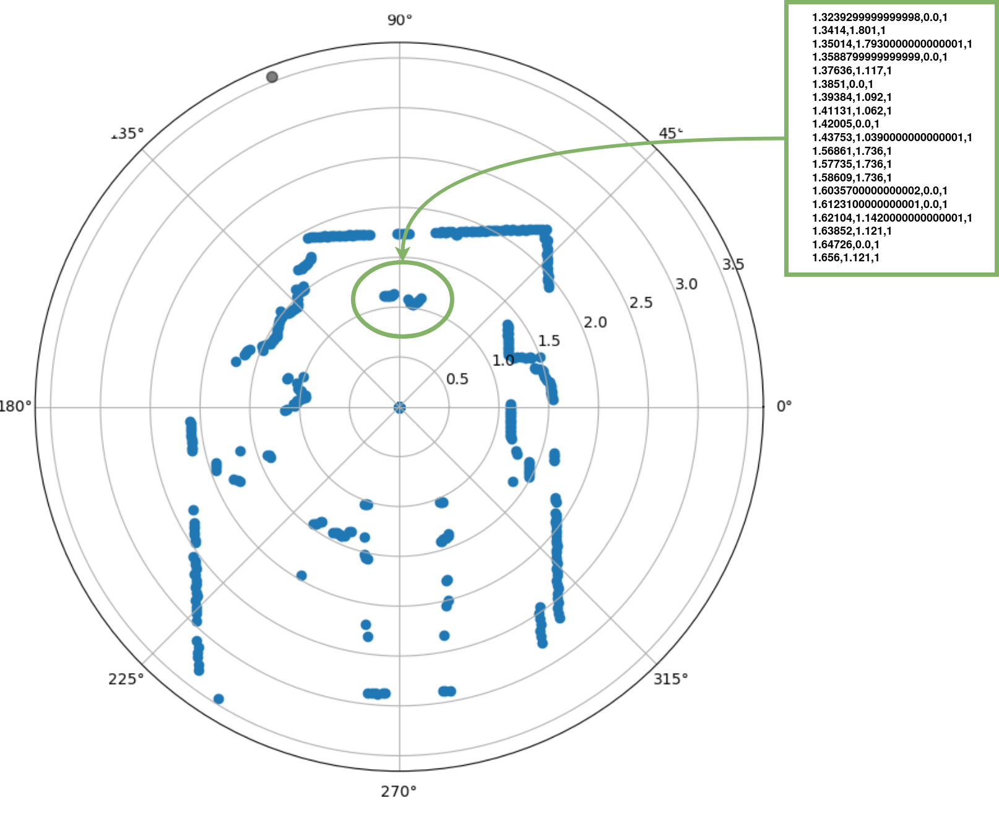

# dataset_lidar2D_legs 

Labeled data from lidar2D, locating legs inside lidar points. 
lidar: ydlidar X4

## Acquisition 

- acquisition pipeline 

- example data extract  

## Description

- folder name discribes the height in cm 
- each csv descibes one acquisition like this: 
    | theta (rad)         | r (m)             | selected (bool) |
    | ------------------- | ----------------- | --------------- |
    | -3.1415900000000003 | 0.0               | 0               |
    | ...                 | ...               | ...             |
    | -2.47745            | .6629999999999999 | 1               |
    | -2.4687099999999997 | 0.645             | 1               |
    | -2.45997            | 0.629             | 1               |
    | -2.45123            | 0.607             | 1               |

